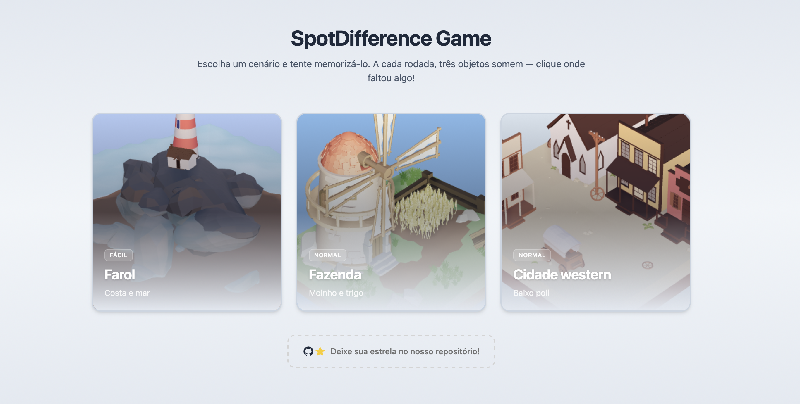
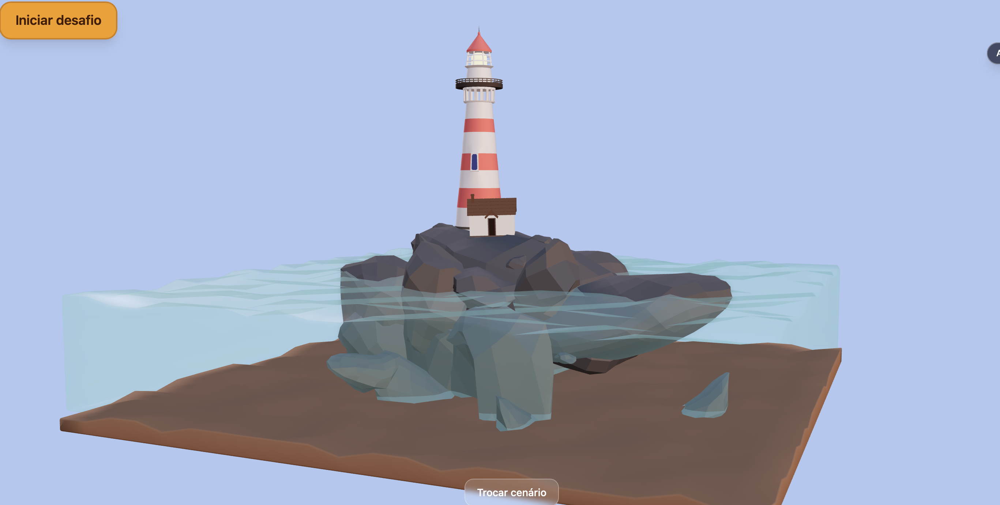
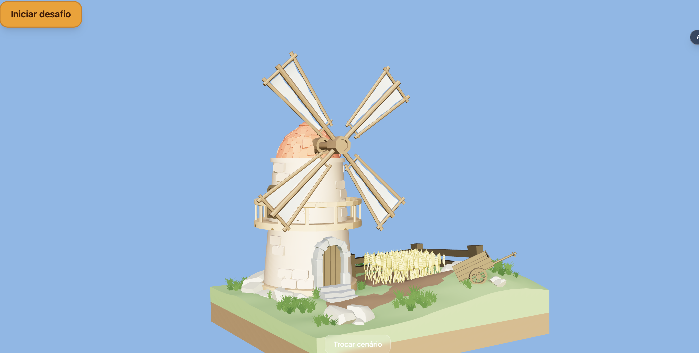

# SpotDifference Game

Jogo de **“sete erros” em 3D** feito com React Three Fiber. Memorize um cenário em baixo poli, inicie o desafio e clique nos lugares onde objetos sumiram.

**Jogar online:** [https://r3f-spot-difference-game-lkxqtz40k-igorpierres-projects.vercel.app](https://r3f-spot-difference-game-lkxqtz40k-igorpierres-projects.vercel.app)



## Como funciona

1. **Escolha um cenário** na tela inicial (Farol, Fazenda ou Cidade western).
2. **Explore e memorize** a cena 3D — arraste para girar e use o scroll para aproximar.
3. Clique em **Iniciar desafio**: três objetos são escolhidos **ao acaso** e somem da cena.
4. **Clique onde faltou algo** para marcar cada diferença encontrada.
5. Acertou as três? Uma nova rodada começa; você pode **memorizar de novo** ou **trocar de cenário** a qualquer momento.

Cada cenário tem um conjunto de objetos que podem desaparecer. A cada rodada, o jogo sorteia quais três serão escondidos — então a partida muda mesmo no mesmo mapa.

## Cenários

| Cenário | Dificuldade | Descrição |
| --- | --- | --- |
| **Farol** | Fácil | Farol em uma ilha rochosa, mar e casa na costa |
| **Fazenda** | Normal | Moinho, trigo e carrinho no campo |
| **Cidade western** | Normal | Cidade do velho oeste em estilo baixo poli |

<p align="center">
  
  
</p>

## Tecnologias

- [React](https://react.dev/) + [Vite](https://vitejs.dev/)
- [React Three Fiber](https://docs.pmnd.rs/react-three-fiber) e [Drei](https://github.com/pmndrs/drei)
- [Three.js](https://threejs.org/)
- [Zustand](https://github.com/pmndrs/zustand) (estado do jogo)
- [Tailwind CSS](https://tailwindcss.com/)

## Pré-requisitos

- [Node.js](https://nodejs.org/) **18 ou superior**
- **npm** (vem com o Node)

> Use **npm** neste projeto. O lockfile oficial é o `package-lock.json` — não use Yarn aqui.

## Instalação e execução

### 1. Clonar o repositório

```bash
git clone https://github.com/IgorPierre/r3f-spot-difference-game.git
cd r3f-spot-difference-game
```

### 2. Instalar dependências

```bash
npm install
```

### 3. Rodar em modo de desenvolvimento

```bash
npm run dev
```

O Vite sobe um servidor local. Abra no navegador o endereço exibido no terminal — em geral:

**http://localhost:5173**

### Outros comandos

| Comando | Descrição |
| --- | --- |
| `npm run dev` | Servidor de desenvolvimento com hot reload |
| `npm run build` | Gera a versão de produção na pasta `dist` |
| `npm run preview` | Serve a build de produção localmente para testar |

Para testar a build antes de publicar:

```bash
npm run build
npm run preview
```

## Controles na cena 3D

| Ação | Controle |
| --- | --- |
| Girar a câmera | Arrastar com o mouse (ou toque) |
| Aproximar / afastar | Scroll do mouse ou gesto de pinça |

## Licença

Projeto de demonstração. Consulte o repositório para detalhes de uso.
